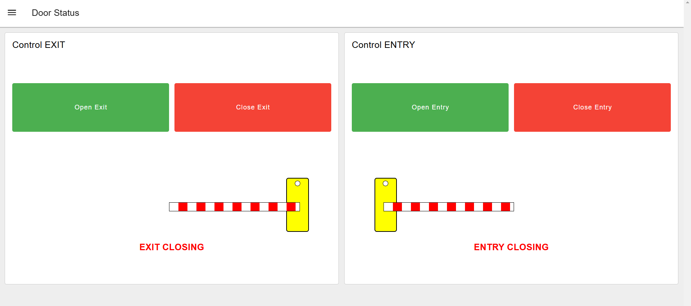
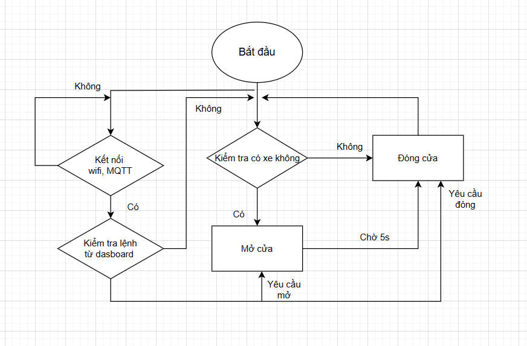
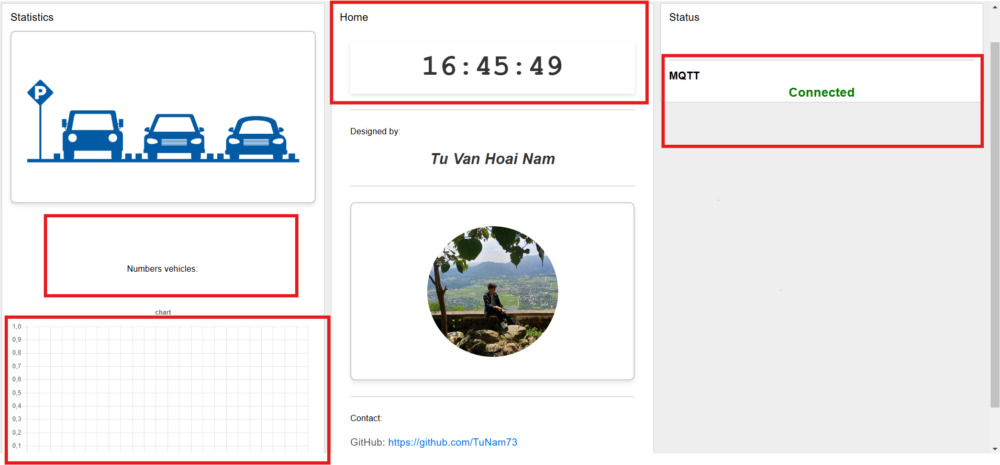
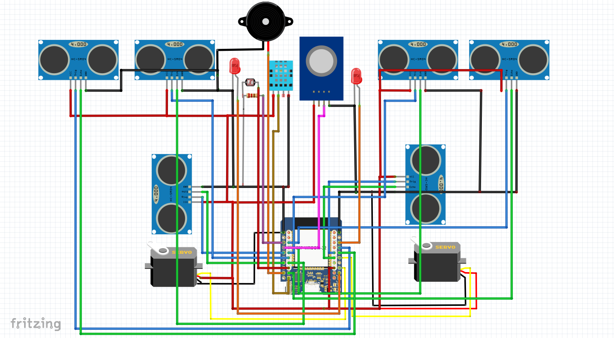
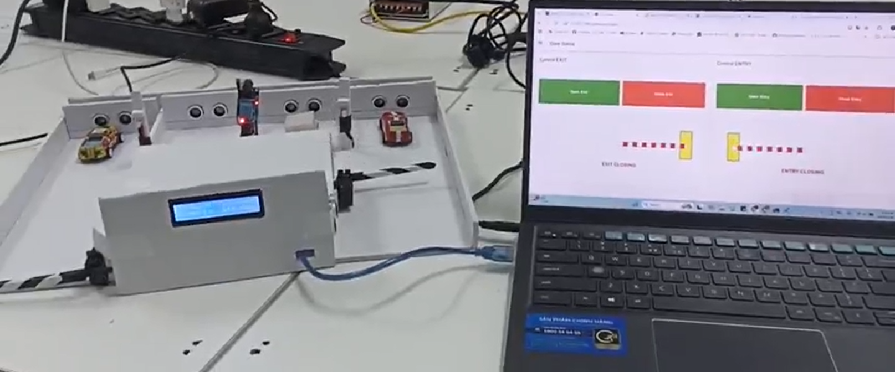
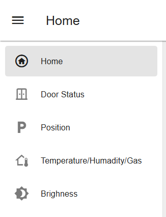
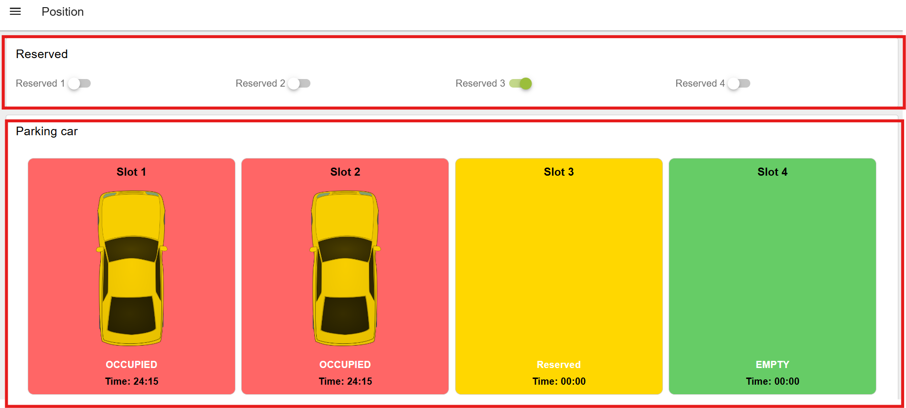
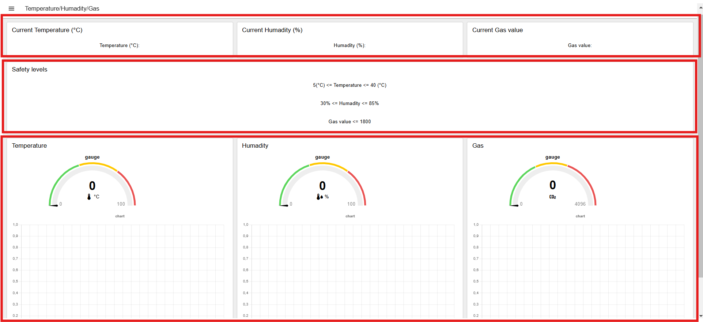
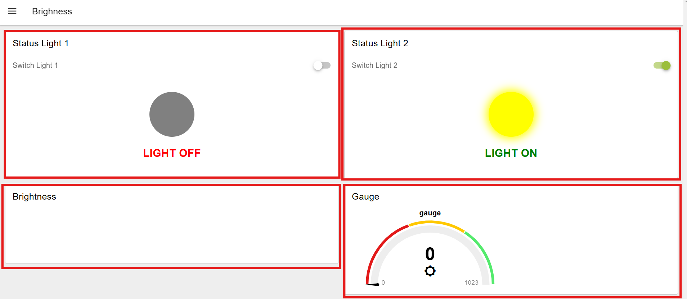

# SMART AND SAFE PARKING SYSTEM

## Problem Statement
__Real-World Demand__

In modern urban areas, the rapid increase in personal vehicles has made traditional parking lots overloaded and inefficient. Manual management not only requires significant human resources but also increases the risk of errors, security breaches, and difficulties in handling incidents like fires. These issues highlight the need for an intelligent parking system with diverse functionalities such as:
- Optimal space and vehicle management: Helps parking lot owners and users easily locate available spaces and maximize space utilization.
- Enhanced safety: Detects and alerts potential risks like fires, smoke, or improperly parked vehicles.
- Automation and cost savings: Minimizes human intervention through IoT integration.

__Inspiration for the Project__

Fire incidents in parking lots: Major fires in underground parking areas underscore the necessity of automated fire detection and response systems.

Lessons from major cities: Many modern cities have adopted smart parking systems, but high implementation costs make these systems less accessible in Vietnam. Developing a simple, cost-effective model can make this technology accessible to small- and medium-sized parking facilities.

# Main Content

1. Hardware
- Microcontroller: MH-ET LIVE MiniKit for ESP32
- Entry/Exit Gates:
    + 2 x Servo SG90: Control gate opening/closing
    + 2 x Obstacle detection sensors: Detect vehicles entering/exiting
- Parking Area:
    + 4 x HC-SR04 ultrasonic sensors: Detect vehicle presence in 4 parking spots
    + 2 x LDRs: Control lights based on ambient light levels
- Safety System:
    + 1 x DHT11: Monitor temperature and humidity
    + 1 x MQ-2: Detect gas and smoke
    + 1 x Buzzer: Alert when a hazard is detected

2. Software
- Node-RED:
    + Display: Number of vehicles and parking spot status
    + Management: Track parking duration, control lighting and gate operation
    + Safety Monitoring: Track temperature, humidity, and gas levels
- MQTT Broker: EMQX
- Development Environment: Platform.IO
3. Concept
- Entry/Exit Gates:
    + Obstacle detection sensors identify vehicles entering or exiting, triggering the ESP32 to control the SG90 servo motors.
    + Gates can also be manually opened/closed via the dashboard.
- Parking Area:
    + Four parking spots monitored by four HC-SR04 ultrasonic sensors to determine availability.
    + Dashboard displays each spot's status: Available / Occupied.
    + Displays the duration of each vehicle's stay.
    + LDR sensors automatically control lights based on environmental brightness, with manual control available from the dashboard.
    + Temperature, humidity, and gas levels are monitored continuously. The buzzer sounds an alarm if hazardous conditions are detected.
    + All environmental data is displayed on the dashboard.

# Block Diagram
1. Block Diagram

2. Algorithm Flowchart
- Entry/Exit Section

- Parking Lot Section

# Pin Diagram
The pin diagram is simulated using Fritzing software.

Connection table with ESP32 pins:

| Devices    |  Pin          | ESP32         |
|------------|---------------|---------------|
| **Servo**  | Vcc           | 5V            |
|            | GND           | GND           |
|            | PWM entry     | 4             |
|            | PWM exit      | 2             |
| **HC-SR04**| Vcc           | 5V            |
|            | GND           | GND           |
| Entry      | trig          | 17            |
|            | echo          | 16            |
| Exit       | trig          | 33            |
|            | echo          | 14            |
| Pos 1      | trig          | 26            |
|            | echo          | 13            |
| Pos 2      | trig          | 19            |
|            | echo          | 18            |
| Pos 3      | trig          | 23            |
|            | echo          | 5             |
| Pos 4      | trig          | 32            |
|            | echo          | 12            |
| **DHT**    | Vcc           | 5V            |
|            | GND           | GND           |
|            | Data          | 10            |
|   **MQ2**  | Vcc           | 5V            |
|            | GND           | GND           |
|            | Analog Out    | 35            |
|**LDR**     | Vcc           | 3.3V          |
|            | GND           | GND           |
|            | Analog Out    | 39            |
| **LED**    | LED 1         | 25            |
|            | LED 2         | 15            |
| **Buzzer** | Signal        | 9             |

## Results
1. Model:

2. Node-red dashboard 2.0
- The Node-red dashboard consists of 5 groups: Home, Door Status, Position, Temperature/Humidity/Gas, Brightness

- The **Home** interface displays the number of vehicles, vehicle statistics over time, the current time (Vietnam time), the author, and the MQTT connection status.

- The **Door Status** interface is used to display and control the status of the entry/exit doors of the parking lot.

- The **Position** interface includes the following features:
    + Check the status of each parking spot: Empty, Occupied, or Reserved.
Reserve available spots.
    + If a spot is occupied, calculate the duration the vehicle has been parked.

- The **Temperature/Humidity/Gas** interface displays temperature, humidity, and gas sensor readings, along with historical data over time.

- The **Brightness** interface is used to display the lighting status, the brightness level of the parking lot, and control the lights (turn on/off).

## Conclusion
- A smart parking system has been successfully developed with the following features:

    + Parking spot management, including the number of vehicles and parking duration.
    + Fire and abnormal event detection (e.g., smoke or high temperature).
    + Automated entry/exit process using sensors and servo doors.
    + Dashboard integration via Node-RED for monitoring and control.

- The MQTT protocol has been successfully implemented to transmit and receive data between system components via brokers like HiveMQ or EMQX.

## Video demo: [Video demo](https://www.youtube.com/watch?v=NGZ4Gfc5JMc)
